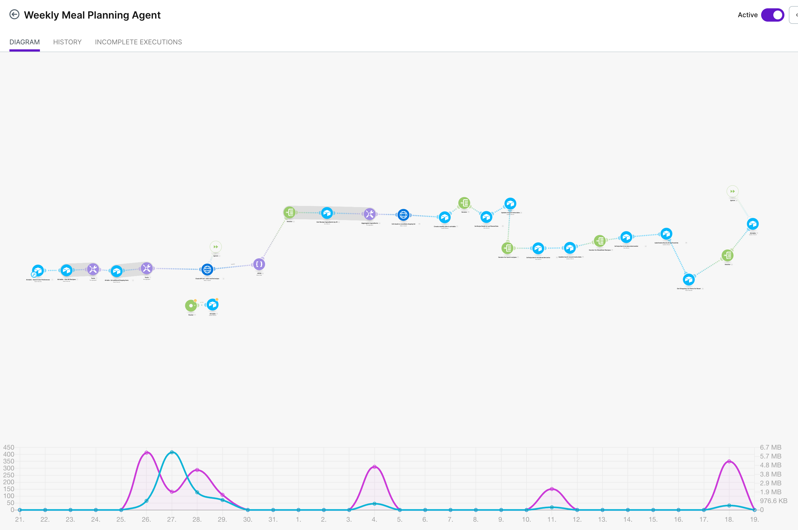

# AI-Powered Meal Planning & Grocery List Automation

**An end-to-end automation system that solves the weekly meal planning and grocery shopping workflow using AI, no-code platforms, and systems thinking.**

---

## The Problem

I hate meal planning. But more accurately, I hate the **entire workflow**:

1. **Deciding what to cook** - balancing variety, health, effort, family preferences, and what's already in the pantry
2. **Remembering what we ate recently** - to avoid repetition
3. **Figuring out side dishes** - that actually pair well and provide nutritional balance
4. **Creating a grocery list** - aggregating ingredients across multiple recipes, consolidating duplicates ("2 cups flour" + "1 cup flour" = "3 cups flour"), and organizing by category
5. **Doing this every single week** - 30-45 minutes of mental overhead

**Every existing solution falls short:**
- **Spreadsheets** - Manual, time-consuming, no intelligence
- **Meal planning apps** - Inflexible, can't handle real-world constraints, terrible recipe databases
- **ChatGPT prompts** - Inconsistent, can't track history, no automated execution
- **HelloFresh/meal kits** - Expensive, limited flexibility, still requires weekly decision-making

I wanted something that would:
- Run automatically every week without manual intervention
- Handle multiple competing constraints intelligently
- Track what we've eaten to ensure variety
- Generate a consolidated, organized grocery list
- Actually work reliably in production

So I built it.

---

## Solution Overview

**An AI-powered automation system that runs every Sunday at 9am MST and:**
1. Selects 5 dinners, 2 lunches, and 2 breakfasts based on 8+ competing constraints
2. Pairs side dishes with main courses intelligently
3. Aggregates all ingredients across all recipes
4. Consolidates duplicate ingredients and organizes by grocery category
5. Updates recipe metadata to track variety over time
6. Provides reasoning for why each recipe was selected

**Tech Stack:**
- **Airtable** - Database for recipes, weekly plans, shopping lists, user preferences
- **Make.com** - Workflow automation platform (35+ modules)
- **Claude API (Sonnet 4)** - AI engine for intelligent recipe selection and ingredient consolidation
- **Prompt Engineering** - Multi-constraint optimization with hard/soft constraint hierarchies

**Runs autonomously. ~98% success rate. Saves 40 minutes per week.**

---

## Architecture

### Data Model (Airtable)

**Recipes Table** (~70 recipes)
- Recipe Name, Meal Type (Dinner/Lunch/Breakfast), Recipe Role (Main Dish/Side Dish)
- Health Score (1-10), Effort Level (Low/Medium/High)
- Primary Protein, Type of Food (cuisine)
- **Last Planned Date** - Critical for variety tracking
- Needs Sides?, Number of Sides Needed, Suggested Sides (linked records)
- Side Type (Starch/Vegetable/Salad)
- Ingredient List (long text)

**Weekly Plans Table** (generated weekly)
- Week Starting Date
- Dinners Planned (5 main dishes + sides), Lunches Planned (2), Breakfasts Planned (2)
- Plan Shopping List (formatted text)
- Reasoning Message (Claude's explanation)
- Plan Generated By (always "AI")

**Shopping List Additions Table**
- Item, Quantity, Category
- Always Include? (staples like milk, eggs)
- Include this week? (one-off additions)

**User Preferences Table** (single record)
- Number of meals to plan per type
- Target Weekly Health Score
- Max High Effort Meals per Week
- Pantry Surplus or Preference (e.g., "lots of ground beef")
- Recipe Search Preferences (weekly notes like "need grilled cheese Wednesday")

### Workflow Visualization

*35+ module automation workflow running on Make.com*

### Workflow Architecture (Make.com)

**Primary Scenario: "Weekly Meal Planning Agent"**

```
Trigger: Scheduled (Sunday 9am MST)
  ↓
Retrieve User Preferences, Recipe Database, Shopping List Additions
  ↓
Aggregate recipe data & shopping list items into text for Claude
  ↓
Claude API Call #1: Recipe Selection
  - Input: User preferences + available recipes + constraints
  - Output: Structured JSON with selected recipe IDs + reasoning
  ↓
Parse JSON response
  ↓
For each selected recipe:
  - Retrieve ingredient lists from Airtable
  - Aggregate all ingredients into single text block
  ↓
Claude API Call #2: Shopping List Generation
  - Input: All ingredients + shopping list additions
  - Output: Consolidated, categorized grocery list
  ↓
Create Weekly Plan record in Airtable with:
  - Linked recipes
  - Shopping list
  - AI reasoning
  ↓
Update Recipe Metadata (3 parallel flows for dinners/lunches/breakfasts):
  - Iterator loops through selected recipes
  - Updates "Last Planned Date" for variety tracking
  ↓
Reset Shopping List flags for next week
```

**Secondary Scenario: "Regenerate Shopping List"**
- Triggered manually via Airtable button
- Re-generates shopping list when user manually swaps recipes
- Reads current recipe selections instead of generating new ones

---

## Key Technical Implementation Details

### 1. Claude API Integration - Recipe Selection

**The Hard Part:** Getting AI to reliably handle multiple competing constraints while remaining flexible enough to adapt to weekly preferences.

**Constraint Hierarchy:**

**HARD CONSTRAINTS (Non-negotiable):**
- Exact meal counts (5 dinners, 2 lunches, 2 breakfasts)
- Meal type integrity (lunch recipes ONLY in lunch array, never in dinner)

**SOFT CONSTRAINTS (Strongly preferred, flexible):**
- Recency: Avoid recipes planned within last 14 days
- User's weekly preferences: Honor specific requests when possible
- Health score: Target average ±1 point
- Effort level: Limit high-effort meals to specified max
- Protein variety: Avoid same protein 3+ days in row
- Seasonal preference: Lowest priority

**Side Dish Logic:**
- When main dish requires sides, select from linked "Suggested Sides"
- **Critical diversity rule:** Never select multiple sides with same Side Type
  - Example: Can't have Rice + Mashed Potatoes (both = Starch)
  - Must balance: Starch + Vegetable, or Starch + Salad, etc.

**Output Format:** Structured JSON
```json
{
  "success": true,
  "dinner_recipes": [
    {"recipe_id": "rec123", "notes": "High protein, haven't had in 3 weeks"},
    ...
  ],
  "lunch_recipes": [...],
  "breakfast_recipes": [...],
  "health_score": 7.2,
  "reasoning": "Selected based on recency, protein variety..."
}
```

### 2. Claude API Integration - Shopping List Generation

**The Hard Part:** Intelligently consolidating ingredients across multiple recipes with different units and quantities.

**Key Requirements:**
- Merge duplicate ingredients (e.g., "2 cups flour" + "1 cup flour" = "3 cups flour")
- Handle unit differences intelligently
- Organize by category (Produce, Dairy, Meat, Pantry, etc.)
- Include all items from "Always Include" and "Include this week" lists
- Note "check pantry" for staples unless recipe needs large quantities

**Output Format:** Formatted text with category headers and bullet points
```
PRODUCE
• 2 lbs tomatoes
• 1 bunch fresh basil
• 3 bell peppers (red)

DAIRY
• 2 cups milk
• 1 cup shredded cheddar cheese
...
```

### 3. Make.com Iterator + Aggregator Pattern

**Critical Pattern Used Throughout Workflow:**

```
Iterator (loops through array)
  → Action Module (processes each item)
    → Aggregator (combines results into single bundle)
```

**Key Configuration:**
- Aggregator's "Source Module" must point to the Iterator, NOT the action module
- This tells Make.com: "Wait until ALL iterations complete before aggregating"

**Example: Dinner Recipe Ingredients**
- Module 23: Iterator loops through `dinner_recipes` array
- Module 24: Get Recipe Details (runs 5+ times, once per dinner + sides)
- Module 25: Aggregator (Source = Module 23) combines all ingredient lists

**Why This Matters:** Without proper aggregator configuration, the workflow processes recipes one at a time instead of batching them for Claude.

### 4. Handling Non-Deterministic Behavior

**Challenge:** Claude API returns different results for identical inputs (by design for variety)

**Early Problem:** Korean Beef selected 3 weeks in a row despite recency constraints

**Root Causes:**
1. Recency constraint was too weak ("prefer recipes not used in 2-3 weeks")
2. User preference to use ground beef overrode recency
3. No clear constraint priority hierarchy

**Solution:**
- Made recency a stronger constraint (14-day hard rule with explicit exceptions)
- Established clear priority: Meal counts > Meal type > Recency > User prefs > Health score
- Changed from "prefer" language to "DO NOT select" for non-negotiable constraints
- Accepted non-determinism as a feature (variety is good), but constrained the solution space

**Result:** ~98% success rate while maintaining flexibility for weekly preferences

---

## Technical Challenges & Solutions

### Challenge 1: Meal Type Contamination

**Problem:** User requested "tuna sandwiches for lunch" in weekly preferences. Claude assigned Tuna Sandwiches to `dinner_recipes` array, resulting in 6 dinners + 1 lunch.

**Why It Happened:**
- User preference constraint said "override other preferences if there's a conflict"
- No explicit protection for meal type integrity
- No enforcement of exact meal counts

**Solution:**
- Made "Exact Meal Counts" the #1 non-negotiable constraint
- Made "Meal Type Integrity" the #2 non-negotiable constraint
- Clarified that user preferences influence soft constraints but cannot violate hard constraints

### Challenge 2: Only Dinners Getting Variety Tracking

**Problem:** Lunches and breakfasts repeated frequently. Only dinner recipes showed recent "Last Planned Date" values.

**Root Cause:**
- Initial implementation only had iterator/update flow for dinners (Modules 28-30-29)
- No parallel flows for lunches and breakfasts

**Solution:**
- Added Module 32-34: Lunch iterator → Get recipe → Update Last Planned Date
- Added Module 35-37: Breakfast iterator → Get recipe → Update Last Planned Date
- All three flows use same pattern (applied learned pattern independently)

### Challenge 3: Computed Field Error

**Problem:** Automation failed with error: "Field 'Times Planned for Dinner' cannot accept a value because the field is computed"

**Root Cause:**
- Changed "Times Planned" from NUMBER field to ROLLUP field during debugging
- Make.com module still had old mapping trying to increment the field
- Can't update computed/rollup fields in Airtable

**Solution:**
- Removed "Times Planned" mapping from update module
- Decided "Times Planned" wasn't necessary (Last Planned Date provides sufficient variety)
- **Key Learning:** When field types change in Airtable, all Make.com modules referencing that field must be updated

### Challenge 4: Make.com Array Indexing

**Problem:** JSON parser initially failed because of 0-indexing assumption

**Root Cause:**
- Make.com uses 1-indexed arrays (unlike most programming languages which use 0-indexing)
- Claude API returns: `{content: [{type: "text", text: "..."}]}`
- To access the text: `{{14.data.content[1].text}}` (not `[0]`)

**Solution:**
- Fixed by using correct 1-indexing or `last()` function
- Caught through systematic debugging and reading Make.com documentation

---

## Results

**Functional Success:**
- ✅ Generates plan every Sunday automatically
- ✅ Selects correct number of recipes per meal type
- ✅ Respects meal type integrity (no lunches in dinner)
- ✅ Tracks Last Planned Date for variety
- ✅ Generates consolidated shopping list
- ✅ Captures Claude's reasoning for transparency

**Quality Metrics:**
- ✅ Recipe variety (14-day recency working)
- ✅ Health score targets (flexible ±1 point)
- ✅ Effort level management (max 1 high-effort meal)
- ✅ Side dish pairing with type diversity
- ✅ ~98% success rate (fails only if database has insufficient recipes)

**User Experience:**
- ✅ Hands-off operation (runs automatically)
- ✅ Manual override capability (swap recipes, regenerate list)
- ✅ Transparency (reasoning field explains selections)
- ✅ Flexibility (natural language weekly preferences)

**Time Savings:**
- **Before:** 30-45 minutes per week manually planning meals
- **After:** 2-3 minutes to review plan and optionally adjust
- **ROI:** ~40 minutes/week saved, ~35 hours/year

---

## What I Learned

### 1. "Working" vs "Reliable" Are Very Different

Early versions "worked" in that they generated meal plans. But they failed in subtle ways:
- Korean Beef appearing 3 weeks in a row
- Lunch recipes showing up as dinners
- Side dishes with duplicate types (two starches)

**The gap between demo and production isn't code—it's reliability under real constraints.**

### 2. Prompt Engineering Is Systems Design

I started thinking about this as "writing better prompts." I ended up doing system architecture:
- Defining hard vs soft constraints
- Establishing priority hierarchies
- Building feedback loops (Last Planned Date)
- Debugging non-deterministic behavior by observing outcomes

**Good prompt engineering requires understanding the system, not just the model.**

### 3. Non-Determinism Can Be a Feature

Claude returns different results for identical inputs. Initially this felt like a bug. But for meal planning, variety IS the goal. The solution wasn't to make it deterministic—it was to constrain the solution space so all valid outputs are acceptable.

**Don't fight the model's nature. Design systems that work with it.**

### 4. Iteration Beats Planning

I spent more time fixing problems discovered in production than I did on the initial build. And that's fine. The failures taught me:
- Where constraints were too loose
- Which data structures were missing
- How to debug AI behavior systematically

**Ship early, observe carefully, iterate quickly.**

### 5. The Right Abstraction Matters

The breakthrough moment was realizing I could use "Last Planned Date" instead of complex "Times Planned" rollup fields. Simpler data model, easier to reason about, more reliable.

**Simplicity is powerful, even in AI systems.**

---

## Project Stats

- **Development Time:** ~15-20 hours over 2 weeks
- **Lines of Prompt Engineering:** ~200 words per Claude call
- **Make.com Modules:** 35+ modules across 2 scenarios
- **Airtable Records:** ~70 recipes, 4 tables
- **API Costs:** $0.02-0.05 per weekly run
- **Production Runtime:** 6+ weeks, zero manual intervention required
- **Success Rate:** ~98%

---

## Future Enhancements (Not Built Yet)

**Near-Term:**
- Recipe status field (Active/Never Again/On Hold) to filter out bad recipes
- Conversational interface for plan adjustments before committing
- Automated recipe discovery via web scraping

**Medium-Term:**
- Macro/calorie tracking for deeper nutrition optimization
- Grocery delivery integration for full end-to-end automation
- Leftover optimization (plan recipes that use previous nights' leftovers)

**Longer-Term:**
- Multi-family coordination (sync plans with friends/family)
- Seasonal ingredient optimization (prefer in-season produce)
- Budget optimization (minimize grocery costs)

---

## Why This Project Matters

This isn't just about meal planning. It's about learning how to build reliable, production-grade AI systems that solve real problems.

The same principles apply to enterprise AI implementations:
- Understanding when AI is the right tool vs when rules-based logic is better
- Designing constraint hierarchies that balance flexibility and reliability
- Building feedback loops to improve over time
- Observing real behavior instead of assuming intent
- Iterating toward production reliability, not just "working" demos

**This project taught me how to make AI actually useful in production environments.**

---

## Technical Stack Details

**Platforms:**
- **Airtable** - Database (Builder Certified)
- **Make.com** - Workflow automation (user since 2017 on Zapier, migrated to Make 2022)
- **Claude API** - Anthropic's Sonnet 4 model (claude-sonnet-4-20250514)

**Skills Applied:**
- Prompt engineering for multi-constraint optimization
- No-code workflow orchestration
- Database schema design
- API integration
- Systems thinking and debugging
- Iterative problem-solving

**Development Environment:**
- Make.com visual workflow builder
- Airtable web interface
- API testing via Make.com HTTP modules
- JSON structure design for Claude responses

---

## About This Project

Built by someone who hates meal planning but loves building systems that solve real problems.

This project demonstrates practical AI implementation, workflow automation, and systems thinking—skills directly applicable to helping customers build reliable AI-powered solutions in production environments.

**Questions? Want to talk about AI, automation, or meal planning?**  
Connect with me on [LinkedIn](your-linkedin-url)
